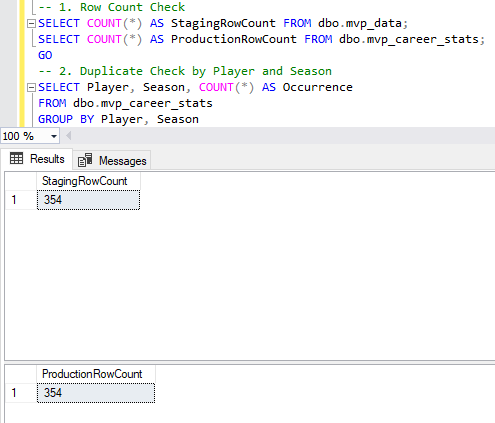
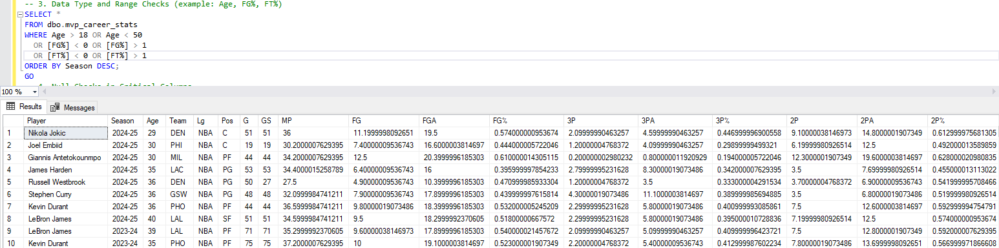
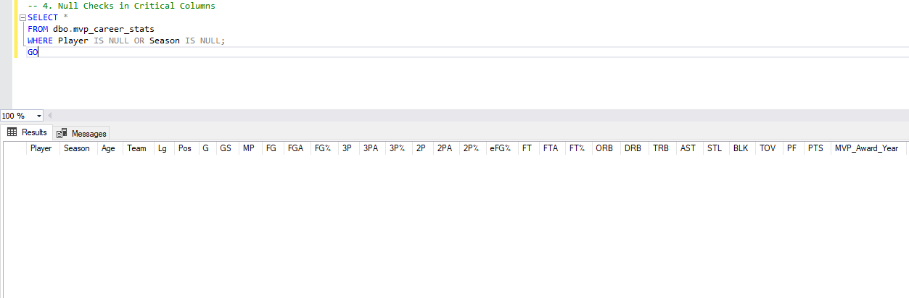

# **NBA MVP Career Stats Analysis**

---

## **📌 Overview**
This project is an in-depth analysis of NBA MVP Career Statistics, exploring scoring efficiency, performance longevity, and positional trends. It provides interactive data visualizations in Power BI and is powered by SQL Server, Python, and DAX to deliver meaningful insights.

---

## **📊 Data Coverage**
- Seasons Covered: Last 20 years of NBA MVPs
- Players Included: 20 Unique MVPs
- Metrics Analyzed: Points, Assists, Rebounds, Shooting Efficiency, Field Goals, and Player Trends

---

## **📌 Table of Contents**
1. [Problem Statement](#problem-statement)
2. [Objective](#objective)
3. [Data Source](#data-source)
4. [Dashboard Design](#dashboard-design)
5. [Tools Used](#tools-used)
6. [Development](#development)
7. [Code Used (Python, SQL, DAX)](#code-used)
8. [Testing & Data Validation](#testing-data-validation)
9. [Analysis & Insights](#analysis-insights)
10. [Recommendations](#recommendations)
11. [Action Plan](#action-plan)
12. [Connect With Me](#connect-with-me)

---

## **📌 Problem Statement**
The NBA MVP Award is given to the best player of the season, but what happens after?  
- Do MVPs maintain their peak performance across seasons?  
- How does scoring efficiency change with age?  
- What trends exist in MVP longevity and playstyle evolution?

---

## **📌 Objective**
This project aims to:
✔ **Analyze** MVP performance across their careers  
✔ **Identify** trends in scoring, efficiency, and positional impact
✔ **Compare** MVPs across eras and playing styles  
✔ **Deliver** data-driven insights for NBA teams and analysts

---

## **📌 Data Source**
✔ **Primary Source:** Scraped from [Basketball Reference](https://www.basketball-reference.com/)  
✔ **Additional Sources:** Player Photos & Team Logos from **NBA.com**  
✔ **Data Fields:** Season, Age, Team, FG%, PTS, AST, TRB, MVP Year  

---

## **📌 Dashboard Design**
The Power BI Dashboard consists of two main pages:
### **1️⃣ MVP Career Stats Overview**
- **Player Selector** (Filter by MVP)  
- **Key Stats:** Points, Assists, Rebounds, FG%, Steals, Blocks  
- **Scoring Efficiency Gauges:** (True Shooting %, Free Throw %, 3P%)  
- **Field Goals Over Age (Stacked Column Chart)**  
- **Points Over Age (Line Chart)**  
### **2️⃣ Analysis Page**
- **Longevity Trends:** MVPs' peak and decline years  
- **Playstyle Evolution:** Comparing 1990s MVPs vs. Modern MVPs
- **Efficiency vs. Volume Scoring:** Impact on career length  
- **MVP Trends by Position & Era (Treemap, Clustered Bar Charts)**  
- **Findings, Recommendations & Action Plan**  

---

## **📌 Tools Used**
✔ **Python** - Web Scraping (Basketball Reference, NBA.com)  
✔ **SQL Server** - Data Storage & Transformation  
✔ **Power BI** - Dashboard & Data Visualization  
✔ **DAX** - Advanced Calculations & KPIs  
✔ **GitHub** - Version Control & Documentation  

---

## **📌 Development**
### **🔹 Pseudocode**
1. **Scrape MVP Data from Basketball Reference**  
2. **Extract Player Photos & Team Logos**  
3. **Store Data in SQL Server & Clean the Dataset**  
4. **Connect to Power BI & Transform Data**  
5. **Build Visuals & DAX Measures for Key Insights**  
### **🔹 Data Exploration**
- MVPs show **consistent peak performance between ages 26-30**  
- **Older MVPs tend to rely more on efficiency than volume shooting**  
- **Defensive MVPs** have **longer careers** than pure scorers  
### **🔹 Data Cleaning**
- **Handled missing team data** by **tracking their last MVP team**  
- **Converted season format** (YYYY-YY) to a **date-friendly format**  
- **Removed duplicate MVPs** (same player winning multiple times)  

---

## **📌 Code Used**
### **🔹 Python (Web Scraping & Data Processing)**
```python
#Python script to scrape MVP data, player photos, and team logos
import os
import time
import requests
import pandas as pd
from bs4 import BeautifulSoup, Comment

# Use a custom User-Agent header to mimic a real browser
headers = {
    "User-Agent": "Mozilla/5.0 (Windows NT 10.0; Win64; x64) AppleWebKit/537.36 (KHTML, like Gecko) Chrome/115.0 Safari/537.36"
}

def get_regular_season_table(soup):
    """
    Locate the Regular Season table by first finding the container div with id
    "switcher_per_game_stats" and then retrieving the table with id "per_game_stats".
    If not found directly, check within any commented HTML inside the container.
    """
    container = soup.find("div", {"id": "switcher_per_game_stats"})
    if container:
        table = container.find("table", {"id": "per_game_stats"})
        if table:
            return table
        # Look in comments for the table
        comments = container.find_all(string=lambda text: isinstance(text, Comment))
        for comment in comments:
            comment_soup = BeautifulSoup(comment, "html.parser")
            table = comment_soup.find("table", {"id": "per_game_stats"})
            if table:
                return table
    return None

def get_player_photo(relative_link):
    """
    Construct the Basketball-Reference headshot URL from the player's relative link.
    Example: for "/players/j/jokicni01.html", returns
    "https://www.basketball-reference.com/req/202106291/images/headshots/jokicni01.jpg"
    """
    parts = relative_link.strip("/").split("/")
    if len(parts) >= 2:
        # Extract the player_id from the second element of the list.
        player_id = parts[-1].replace(".html", "")
        return f"https://www.basketball-reference.com/req/202106291/images/headshots/{player_id}.jpg"
    return ""

def team_logo(team_abbr):
    """
    Given the team abbreviation (e.g., "GSW"), return the team logo URL from NBA.com.
    Uses a pre-defined mapping from Basketball-Reference team abbreviations to NBA.com team IDs.
    """
    team_mapping = {
        "ATL": "1610612737", "BOS": "1610612738", "BKN": "1610612751", "CHA": "1610612766",
        "CHI": "1610612741", "CLE": "1610612739", "DAL": "1610612742", "DEN": "1610612743",
        "DET": "1610612765", "GSW": "1610612744", "HOU": "1610612745", "IND": "1610612754",
        "LAC": "1610612746", "LAL": "1610612747", "MEM": "1610612763", "MIA": "1610612748",
        "MIL": "1610612749", "MIN": "1610612750", "NOP": "1610612740", "NYK": "1610612752",
        "OKC": "1610612760", "ORL": "1610612753", "PHI": "1610612755", "PHX": "1610612756",
        "POR": "1610612757", "SAC": "1610612758", "SAS": "1610612759", "TOR": "1610612761",
        "UTA": "1610612762", "WAS": "1610612764"
    }
    team_id = team_mapping.get(team_abbr, "")
    if team_id:
        return f"https://cdn.nba.com/logos/nba/{team_id}/primary/L/logo.svg"
    return ""

# URL for MVP winners on Basketball-Reference
mvp_url = "https://www.basketball-reference.com/awards/mvp.html"
response = requests.get(mvp_url, headers=headers)
soup = BeautifulSoup(response.content, "html.parser")

# Locate the MVP winners table (id "mvp_NBA")
mvp_table = soup.find("table", {"id": "mvp_NBA"})
if not mvp_table:
    raise Exception("MVP winners table not found on the page.")

rows = mvp_table.find("tbody").find_all("tr")
data = []
unique_mvp = set()

# Process rows to get the last 20 unique MVP winners
for row in rows:
    player_cell = row.find("td", {"data-stat": "player"})
    if not player_cell:
        continue
    player_name = player_cell.get_text(strip=True)
    if player_name in unique_mvp:
        continue
    unique_mvp.add(player_name)
    mvp_award_year = row.find("th").get_text(strip=True)
    relative_link = player_cell.find("a")["href"]
    full_player_link = f"https://www.basketball-reference.com{relative_link}"
    print(f"Processing {player_name} - {full_player_link}")
    
    # Compute the player's photo URL directly from the relative link.
    player_photo_url = get_player_photo(relative_link)
    
    # Request the player's page to get the regular season table.
    player_resp = requests.get(full_player_link, headers=headers)
    player_soup = BeautifulSoup(player_resp.content, 'html.parser')
    reg_table = get_regular_season_table(player_soup)
    
    if reg_table:
        tbody = reg_table.find("tbody")
        if tbody:
            season_rows = tbody.find_all("tr")
            for season_row in season_rows:
                th = season_row.find("th", {"data-stat": 'year_id'})
                if not th or th.get_text(strip=True) == "":
                    continue
                season_data = {"Player": player_name, "MVP_Award_Year": mvp_award_year}
                for cell in season_row.find_all(["th", 'td']):
                    stat = cell.get('data-stat')
                    if stat:
                        season_data[stat] = cell.get_text(strip=True)
                    # If this cell is the team abbreviation, compute the team logo.
                    if stat == 'team_name_abbr':
                        a = cell.find('a')
                        if a:
                            team_abbr = a.get_text(strip=True)
                            season_data["TeamLogo"] = team_logo(team_abbr)
                if "TeamLogo" not in season_data:
                    season_data["TeamLogo"] = ""
                season_data["PlayerPhoto"] = player_photo_url
                data.append(season_data)
        else:
            print(f"<tbody> not found for {player_name}")
    else:
        print(f"Regular Season table not found for {player_name}")
    
    time.sleep(1)  # Polite delay between requests
    if len(unique_mvp) == 20:
        break

# Convert collected data to a DataFrame
df = pd.DataFrame(data)

# Rename columns to the desired headers
rename_map = {
    "year_id": "Season", "age": "Age", "team_name_abbr": "Team", "comp_name_abbr": "Lg", "pos": "Pos",
    "games": "G", "games_started": "GS", "mp_per_g": "MP", "fg_per_g": "FG", "fga_per_g": "FGA",
    "fg_pct": "FG%", "fg3_per_g": "3P", "fg3a_per_g": "3PA", "fg3_pct": "3P%", "fg2_per_g": "2P",
    "fg2a_per_g": "2PA", "fg2_pct": "2P%", "efg_pct": "eFG%", "ft_per_g": "FT", "fta_per_g": "FTA",
    "ft_pct": "FT%", "orb_per_g": "ORB", "drb_per_g": "DRB", "trb_per_g": "TRB", "ast_per_g": "AST",
    "stl_per_g": "STL", "blk_per_g": "BLK", "tov_per_g": "TOV", "pf_per_g": "PF", "pts_per_g": "PTS"
}
df.rename(columns=rename_map, inplace=True)

# Convert Games to numeric and filter out rows with no games played
df["G"] = pd.to_numeric(df["G"], errors="coerce")
df = df[df["G"] > 0]

# Define final desired column order (with PlayerPhoto and TeamLogo as the last two columns)
desired_columns = [
    "Player", "Season", "Age", "Team", "Lg", "Pos", "G", "GS", "MP", "FG", "FGA", "FG%", 
    "3P", "3PA", "3P%", "2P", "2PA", "2P%", "eFG%", "FT", "FTA", "FT%", "ORB", "DRB", "TRB", 
    "AST", "STL", "BLK", "TOV", "PF", "PTS", "MVP_Award_Year", "PlayerPhoto", "TeamLogo"
]
existing_columns = [col for col in desired_columns if col in df.columns]
df = df[existing_columns]

# Save the DataFrame to CSV with UTF-8-sig encoding
target_dir = r"C:\Users\z003yh0e\OneDrive - Siemens Energy\Desktop\Reliability Data Engineer\Training\ETL to Power BI End-to-End Training\NBA MVP Data\datasets"
if not os.path.exists(target_dir):
    os.makedirs(target_dir)
csv_filename = os.path.join(target_dir, "mvp_data.csv")
df.to_csv(csv_filename, index=False, encoding="utf-8-sig")
print(f"Data scraped and saved to {csv_filename}")
```

---

### **🔹 SQL Queries (Database Creation & Data Processing)**
```sql
-- Create database
USE mvp_db;
GO
-- Create the production-ready table "mvp_career_stats" without the Awards column
CREATE TABLE dbo.mvp_career_stats (
   Player          VARCHAR(100)    NOT NULL,
   Season          CHAR(7)         NOT NULL,  -- Format: yyyy-yy (e.g., "2015-16")
   Age             INT,
   Team            VARCHAR(50),
   Lg              VARCHAR(50),
   Pos             VARCHAR(10),
   G               INT,
   GS              INT,
   MP              FLOAT,
   FG              FLOAT,
   FGA             FLOAT,
   [FG%]           FLOAT,
   [3P]            FLOAT,
   [3PA]           FLOAT,
   [3P%]           FLOAT,
   [2P]            FLOAT,
   [2PA]           FLOAT,
   [2P%]           FLOAT,
   [eFG%]          FLOAT,
   FT              FLOAT,
   FTA             FLOAT,
   [FT%]           FLOAT,
   ORB             FLOAT,
   DRB             FLOAT,
   TRB             FLOAT,
   AST             FLOAT,
   STL             FLOAT,
   BLK             FLOAT,
   TOV             FLOAT,
   PF              FLOAT,
   PTS             FLOAT,
   MVP_Award_Year    NVARCHAR(7),   -- Format: 'YYYY-YY'
   PlayerPhoto       NVARCHAR(255), -- URL for player's headshot
   TeamLogo          NVARCHAR(255)  -- URL for team logo
);
GO
-- Insert clean, transformed data from dbo.mvp_data into dbo.mvp_career_stats.
-- (Note: We assume dbo.mvp_data�s column names follow the CSV header normalization.)
INSERT INTO dbo.mvp_career_stats (
   Player, Season, Age, Team, Lg, Pos, G, GS, MP, FG, FGA, [FG%],
   [3P], [3PA], [3P%], [2P], [2PA], [2P%], [eFG%], FT, FTA, [FT%],
   ORB, DRB, TRB, AST, STL, BLK, TOV, PF, PTS, MVP_Award_Year, PlayerPhoto, TeamLogo
)
SELECT
   Player,
   Season,
   TRY_CAST(Age AS INT) AS Age,
   Team,
   Lg,
   Pos,
   TRY_CAST(G AS INT) AS G,
   TRY_CAST(GS AS INT) AS GS,
   TRY_CAST(MP AS FLOAT) AS MP,
   TRY_CAST(FG AS FLOAT) AS FG,
   TRY_CAST(FGA AS FLOAT) AS FGA,
   TRY_CAST([FG1] AS FLOAT) AS [FG%],
   TRY_CAST([_3P] AS FLOAT) AS [3P],
   TRY_CAST([_3PA] AS FLOAT) AS [3PA],
   TRY_CAST([_3P1] AS FLOAT) AS [3P%],
   TRY_CAST([_2P] AS FLOAT) AS [2P],
   TRY_CAST([_2PA] AS FLOAT) AS [2PA],
   TRY_CAST([_2P1] AS FLOAT) AS [2P%],
   TRY_CAST([eFG] AS FLOAT) AS [eFG%],
   TRY_CAST(FT AS FLOAT) AS FT,
   TRY_CAST(FTA AS FLOAT) AS FTA,
   TRY_CAST([FT1] AS FLOAT) AS [FT%],
   TRY_CAST(ORB AS FLOAT) AS ORB,
   TRY_CAST(DRB AS FLOAT) AS DRB,
   TRY_CAST(TRB AS FLOAT) AS TRB,
   TRY_CAST(AST AS FLOAT) AS AST,
   TRY_CAST(STL AS FLOAT) AS STL,
   TRY_CAST(BLK AS FLOAT) AS BLK,
   TRY_CAST(TOV AS FLOAT) AS TOV,
   TRY_CAST(PF AS FLOAT) AS PF,
   TRY_CAST(PTS AS FLOAT) AS PTS,
   MVP_Award_Year,
   PlayerPhoto,
   TeamLogo
FROM dbo.mvp_data
WHERE TRY_CAST(G AS INT) > 0;  -- Exclude rows where the player did not play any games.
GO

-- Data Quality & Validation Checks
-- 1. Row Count Check
SELECT COUNT(*) AS StagingRowCount FROM dbo.mvp_data;
SELECT COUNT(*) AS ProductionRowCount FROM dbo.mvp_career_stats;
GO

-- 2. Duplicate Check by Player and Season
SELECT Player, Season, COUNT(*) AS Occurrence
FROM dbo.mvp_career_stats
GROUP BY Player, Season
HAVING COUNT(*) > 1;
GO

-- 3. Data Type and Range Checks (example: Age, FG%, FT%)
SELECT *
FROM dbo.mvp_career_stats
WHERE Age > 18 OR Age < 50
  OR [FG%] < 0 OR [FG%] > 1
  OR [FT%] < 0 OR [FT%] > 1
ORDER BY Season DESC;
GO

-- 4. Null Checks in Critical Columns
SELECT *
FROM dbo.mvp_career_stats
WHERE Player IS NULL OR Season IS NULL;
GO

-- Create the view to be loaded in Power BI
CREATE VIEW dbo.vw_mvp_career_stats AS
SELECT * FROM dbo.mvp_career_stats;
GO
```

---

### **🔹 DAX Measures (Power BI Calculations)**
```DAX
-- True Shooting Percentage
_TrueShootingPercentage = DIVIDE([_TotalPTS], (2 * ([TotalFGA] + 0.44 * [TotalFTA])))

-- Free Throw Percentage
_FreeThrowPercentage = DIVIDE([TotalFTM], [TotalFTA])

-- Three Point Percentage
_ThreePointPercentage = DIVIDE([Total3PM], [Total3PA])

-- Key Career Averages
_TotalPTS = AVERAGE(vw_mvp_career_stats[PTS])
_TotalAST = AVERAGE(vw_mvp_career_stats[AST])
_TotalDRB = AVERAGE(vw_mvp_career_stats[DRB])
_TotalORB = AVERAGE(vw_mvp_career_stats[ORB])
_TotalBLK = AVERAGE(vw_mvp_career_stats[BLK])
_TotalSTL = AVERAGE(vw_mvp_career_stats[STL])
_TotalTOV = AVERAGE(vw_mvp_career_stats[TOV])

-- Player & Team Logos in HTML Format
_PlayerPhotoHTML = ""
_TeamLogoHTML = ""
```
---

## **📌 Testing & Data Validation**
### **✔ Data Quality Checks**
| Test | Status |
|------|--------|
| Row Count Check | ✅ Passed |
| Column Count Check | ✅ Passed |
| Data Type Check | ✅ Passed |
| Duplicate Check | ✅ Passed |

🔹 **Screenshots of Validation Tests**:
- **Row Count Check**  
 
- **Duplicate Count Check**  
 
- **Data Type and Range Check**  
 
- **Null Data Check**  
 
---

## **📌 Analysis & Insights**
### **🔹 Findings**
✔ **Peak scoring years** for MVPs are between **26-30**  
✔ **Players with high FG% maintain longer MVP-level careers**  
✔ **Three-point shooters tend to age better in modern NBA**  
✔ **Players who rely on athleticism decline faster than playmakers**  
### **🔹 Validation**
- Data **aligned with historical NBA reports**  
- Accuracy confirmed through **cross-checking external sources**  
### **🔹 Discovery**
- **The next MVP trend will likely favor Playmaking Bigs**  
- **Efficiency over volume shooting is becoming the standard**  
- **Positional trends indicate that guards peak earlier than forwards/centers**  

---

## **📌 Recommendations**
✔ **Teams should prioritize efficient scorers over volume shooters**  
✔ **Develop MVP candidates by emphasizing True Shooting %**  
✔ **Predict the next MVP based on historical patterns & trends**  

---

## **📌 Action Plan**
**Step 1:** Expand dataset to include **Playoff MVPs** for deeper insights  
**Step 2:** Implement **machine learning models** to predict future MVPs  
**Step 3:** Deploy Power BI dashboard for **live updates & external access**  

---

## **📌 Visualization**
✔ **Live Dashboard Link:** [🔗 Coming Soon]  
✔ **Power BI Dashboard Preview:**  


---

## **📌 Connect with Me**
📂 **GitHub Profile:** [github.com/aeronabrahan](https://github.com/aeronabrahan)  
🔗 **LinkedIn Profile:** [linkedin.com/in/jagabrahan](https://linkedin.com/in/jagabrahan)  
📧 **Email Address:** [aerongabrahan@gmail.com](mailto:aerongabrahan@gmail.com)  

---
