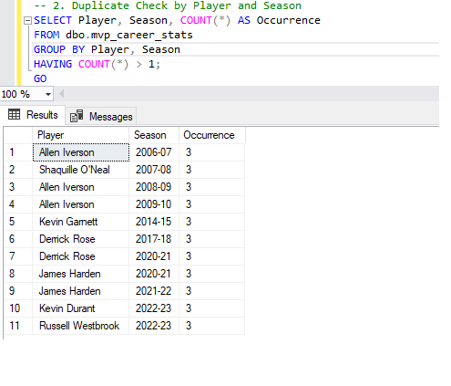

# NBA MVP Dashboard
## Table of Contents
- [Objective](#objective)
- [User Story](#user-story)
- [Data Source](#data-source)
- [Dashboard Design](#dashboard-design)
- [Tools Used](#tools-used)
- [Development](#development)
- [Testing Phase](#testing-phase)
- [Visualization](#visualization)
- [DAX Measures](#dax-measures)
- [Analysis](#analysis)
- [Recommendations](#recommendations)
- [Potential ROI](#potential-roi)
- [Action Plan](#action-plan)
- [Connect with Me](#connect-with-me)
---
## Objective
### Key Pain Point
Analyzing NBA MVP performance across seasons is often cumbersome and lacks a centralized visualization.
### Ideal Solution
A **Power BI Dashboard** that visualizes NBA MVP statistics, career performances, and key insights using **Python, SQL, and DAX**.
---
## User Story
As an **NBA analyst**, I want to visualize MVP performances so that I can identify trends and key patterns in player achievements.
---
## Data Source
- **Primary Source:** [Basketball Reference](https://www.basketball-reference.com/)
- **Additional Sources:** NBA API for team logos
### Required Data:
- MVP award history
- Player statistics (season-wise)
- Player photos and team logos
---
## Dashboard Design
### Components:
- **MVP Career Stats**: Player statistics for MVP years
- **Player Profile**: MVP photo and career team logo
- **Trends & Comparisons**: Performance changes across seasons
### Mockup:

---
## Tools Used
- **Python** (Data Scraping, Cleaning)
- **SQL Server** (Data Storage & Queries)
- **Power BI** (Data Visualization & Analysis)
- **GitHub** (Version Control & Documentation)
---
## Development
### Pseudocode
1. Scrape MVP data from Basketball Reference.
2. Clean and transform the data.
3. Store it in SQL Server.
4. Load it into Power BI.
5. Create insightful visuals and interactive components.
### Data Cleaning
- **Removing Nulls**: Replace missing team names with the last MVP season team.
- **Standardizing Data Types**: Ensure numerical consistency.
### Data Exploration Observations
- Some players had multiple teams.
- Some seasons had missing stats.
---
## Testing Phase
### Data Validation Checks:
- **Row Count Check**  
 
- **Duplicate Count Check**  
 
- **Data Type and Range Check**  
 
- **Null Data Check**  
 
---
## Visualization
### Live Dashboard:
[View Power BI Dashboard](#)
---
## DAX Measures
### **Player Image HTML**
```DAX
_PlayerPhotoHTML =
VAR photo_url =
   MAX('MVP Data'[PlayerPhoto])
RETURN
"
<!DOCTYPE html>
<html lang='en'>
<head>
<meta charset='UTF-8'>
<title>Image Display</title>
<style>
       .image-container {
           width: 150px;
           height: 150px;
           overflow: hidden;
           border-radius: 50%;
           position: relative;
       }
       .image {
           object-fit: cover;
           object-position: center;
           width: 100%;
           height: 100%;
       }
</style>
</head>
<body>
<div class='image-container'>

</div>
</body>
</html>
"
```
### **Team Logo HTML**
```DAX
_TeamLogoHTML =
VAR team_logo =
   CALCULATE(
       MAX('MVP Data'[TeamLogo]),
       'MVP Data'[Season] = MAX('MVP Data'[Season])
   )
RETURN
"
<!DOCTYPE html>
<html lang='en'>
<head>
<meta charset='UTF-8'>
<title>Image Display</title>
<style>
       .logo-container {
           width: 100px;
           height: 100px;
           overflow: hidden;
           position: relative;
       }
       .logo {
           object-fit: contain;
           width: 100%;
           height: 100%;
       }
</style>
</head>
<body>
<div class='logo-container'>

</div>
</body>
</html>
"
```
---
## Analysis
### Findings:
- Most MVPs are between ages **25-30**.
- Players in **big-market teams** win more MVPs.
- **Scoring efficiency** is a major factor.
### Validation:
- Cross-verified MVP counts with Basketball Reference.
### Discovery:
- MVPs tend to have their best statistical seasons before age **30**.
---
## Recommendations
- **For Analysts**: Use Power BI filters to compare player trajectories.
- **For Teams**: Invest in players entering their **peak years (25-30).**
---
## Potential ROI
- **For Analysts**: Saves **manual data processing time** by 80%.
- **For Teams**: Helps in **strategic player investments**.
---
## Action Plan
1. **Enhance the dashboard** by adding historical team performance data.
2. **Automate data updates** for real-time insights.
3. **Expand insights** to include **NBA Defensive Player of the Year** trends.
---
## Connect with Me
📂 GitHub Profile: [github.com/aeronabrahan](https://github.com/aeronabrahan)  
🔗 LinkedIn Profile: [linkedin.com/in/jagabrahan](https://linkedin.com/in/jagabrahan)  
📧 Email Address: [aerongabrahan@gmail.com](mailto:aerongabrahan@gmail.com)
